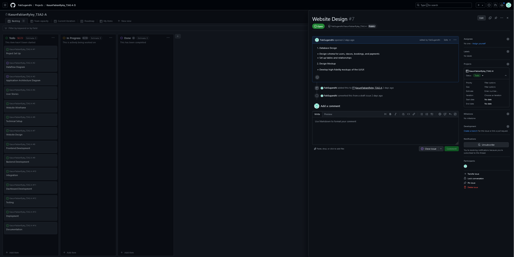

# T3A2-A: Full Stack App

Coder Academy Term 3 Assignment 2

### Student Name:

Kasun Don\
Fabian Sugandhi\
Ryley Croucher

# Part A

## R1

### Purpose, Features and Target Audience

The purpose of this web application is to streamline the booking and management process for a boxing gym, providing an efficient and user-friendly platform for both clients and the gym owner. The app aims to enhance the client experience by allowing them to easily create accounts, manage their profiles, and book classes like Cardi Box, Fighters Academy, Open Gym, and Kids Boxing. Clients will be able to search for classes that fit their schedules, check availability, and manage their bookings with ease.

For the gym owner, the app offers a comprehensive dashboard to monitor class enrollments, track attendance, manage payments, and edit class details. This feature-rich platform will also facilitate the collection of payments for various membership packages, ensuring a seamless process for both short-term and long-term clients. By automating these processes, the app will free up valuable time for the gym owner, allowing them to focus more on delivering high-quality training to their clients while improving operational efficiency and client satisfaction.

### Tech Stack

- **Frontend**:
  - React
  - HTML
  - CSS
  - JavaScript
  - Vite
  - Netlify (for deployment)

- **Backend**:
  - Node.js
  - Express.js
  - Mongoose (for defining schemas and models)
  - Render (for hosting)

- **Database**:
  - MongoDB
  - MongoDB Atlas (for managed cloud service)

## R2: Dataflow Diagram

### Level 0

### Level 1

#### Entities:

- Member: Users who sign up, book classes, make payments, and view their dashboard.
- Owner: Manages classes and performs administrative tasks.

#### Processes:

- User Authentication: Handles user signup, login, and profile management.
- Class Management: Manages class schedules and availability.
- Class Booking: Allows users to book classes based on availability.
- Payment Processing: Handles payment for different packages.
- User Dashboard: Allows users to view their class bookings, payment status, and manage their profiles.

#### Database:

- Member Database: Stores member details.
- Class Schedule Database: Stores class schedules and details.
- Booking Database: Stores class bookings made by members.
- Payment Database: Stores payment information for memberships and any day passes

## R3: Application Architecture Diagram

In the front end of our project React will handle the UI rendering while HTML, CSS and Javascript will be the foundational languages used to structure the front end web application. Vite will also be used to streamline development to get our front functioning as efficiently as possible. Netlify will be used to host our front end for deployment.

As the user interacts with the front end it will make HTTP requests to the back end of our application which in turn will reply with an API response.

Node js and Express js will handle the incoming HTTP requests from the front end and properly route them to the appropriate controller or middleware, and generate the corresponding API responses. Express.js will be responsible for setting up the routes, handling middleware functions, and managing the application's logic, while Node.js will handle the server-side execution and processing of these requests. This setup ensures efficient communication between the front end and back end, allowing for a seamless user experience. Render will be used as the hosting platform for our back end as it offers hosting for dynamic web applications that fit our project. Mongoose may also be used to define schemas and models for our MongoDB database.

In our database, MongoDB will be responsible for storing and managing application data, including user information. To host this database we've opted for Atlas, a fully managed cloud service tailored specifically for MongoDB that ensure reliability.

## R4: User Stories

### User Story 1: Boxing Instructor

Name: Josh
Age: 28

About:
Josh is a boxing instructor passionate about fitness and teaching others. He runs a local boxing gym, offering classes like Cardio Boxing, Fighters Academy, Open Gym, and Kids Boxing. Josh is committed to providing the best experience for his clients but finds it challenging to manage all administrative tasks while focusing on training his clients.

Needs:

- Easily manage class schedules, enrollments, and payments.
- Monitor class attendance.

Frustrations:

- Struggles with balancing administrative tasks and training responsibilities between classes.
- Finds it a hassle to track payments and attendance manually.

User Stories:

- *As a user*, I want to see how many people have enrolled in each class so that I can prepare the right resources and plan my sessions effectively.
- *As a user*, I want to update class schedules and availability easily so that clients can see when classes are available each week.
- *As a user*, I want to track whether attendees have paid for classes so that I can manage payments efficiently without interrupting training sessions.
- *As a user*, I want to sign up new members to the gym directly through the web app so that I can streamline the onboarding process and grow my client base.

### User Story 2: Boxing Class Member

Name: Claire
Age: 22

About:
Claire is a university student who stays active through boxing classes. With her busy study schedule, Claire needs a flexible and convenient way to book her boxing classes, track her progress, and manage her membership.

Needs:

- See when classes are available to plan her schedule.
- Manage her class enrollments easily.
- Search for classes available at specific times and days.
- Pay for her membership securely and conveniently.
- Receive notifications about class times and reminders.

Frustrations:

- Finds it hard to locate classes that fit into her busy schedule.
- Tends to forget when she has booked a class for.

User Stories:

- *As a user*, I want to see when classes are available so that I can plan my schedule around them.
- *As a user*, I want to manage my class enrollments through the app so that I can easily adjust my bookings if my plans change.
- *As a user*, I want to pay for my membership directly through the app so that I can handle all my gym-related tasks in one place.
- *As a user*, I want to receive notifications about class times and reminders so that I don't miss any sessions.

## R5: Wireframes

The wireframe was created using [Figma](https://www.figma.com/). These are the initial wireframes that will be used as the base for the website. These are not final, and further additions, omissions, and alterations, which might include additional pages, is very likely to be adopted in order to facilitate a functional and user-friendly website. Some items in the wireframe are coloured RED. This is to indicate that the items are buttons that will lead to either another page or a document that can be downloaded. Four (4) pages are created as a basis, namely: Homepage, Facilities (which will include overview of all the gym facilities and classes), Members (which will include all membership and individual class pass purchase information), and Contact (indicated as Location in the wireframe as the gym might have multiple locations, this page will include the gym address and an enquiry form). For the initial plan, two (2) screen sizes have been accomodated: Mobile Devices (up to 768px wide) and Tablet & Laptop (above 768px wide). The Tablet layout will be differentiated from the Laptop layout by adjusting the margin. As done with the page inclusion, this is subject to future adjustments once the actual design progresses.

### Homepage (Mobile)

### Homepage (Laptop & Tablet)

### Facilities (Mobile)

### Facilities (Laptop & Tablet)

### Members (Mobile)

### Members (Laptop & Tablet)

### Contact (Mobile)

### Contact (Laptop & Tablet)

## R6: Project Management

Link to the [Implementation Plan](https://github.com/users/FabSugandhi/projects/4/views/1), created using GitHub Project.

Below are the screenshots of the project overview, as well as the individual items that will be involved in the whole project. This will be updated regularly, and progress will be monitored to ensure that the project will be completed in the required timeline. Up to the submission of T3A2-A, dated 18 August 2024. the project timeline had been followed with no significant deviation.

### Project Overview

### Project Timeline

### Project Setup

### Dataflow Diagram

### Architecture Diagram

### User Stories

### Wireframe

### Technical Setup

### Website Design

### Frontend Development

### Backend Development

### Integration

### Dashboard Development

### Testing

### Deployment

### Documentation

# Part B

## R10

The website is deployed and hosted at https://fighttrack.xyz/ \
You can also click this [LINK](https://fighttrack.xyz/) to go the home page of the website.

## R11
The GitHub repository of this website can be accessed by clicking this [LINK](https://github.com/FabSugandhi/FightTrack).

